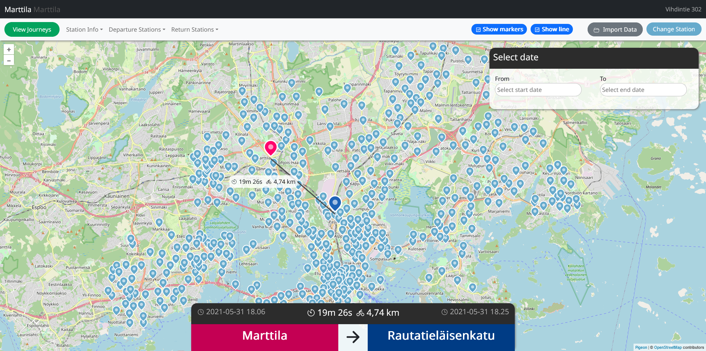

## Bikeapp

This application allows users to view bicycle stations and journeys between these stations on a map. The stations and journeys are stored in a database.

# Technologies

Frontend: TypeScript and React
Packages used in frontend: 
- Pigeon maps <https://pigeon-maps.js.org/> - for simple map implementation
- Recoil <https://recoiljs.org/> (for sharing data between components in a clean way)
- React Icons <https://react-icons.github.io/react-icons/> (Ionicons <https://ionicons.com/> and Remix icons <https://github.com/Remix-Design/RemixIcon>)
- React bootstrap (for styling and components) - <https://react-bootstrap.github.io/>
- React datepicker <https://reactdatepicker.com/>

Backend: Java and Spring Boot

Tests: Cypress

I previously had no experience using TypeScript so I wanted to learn it. Other languages and frameworks were familiar but I wanted to learn more about them.

# Features

- Journey listing with filtering and ordering
- Station listing with station search
- View station info
- View journey info
- Map for viewing station locations and journeys
- Data import through UI
- Date filter for journeys
- Map settings
- e2e tests for frontend

# OS

Tested operating systems:

<li>Windows 10

# Setting up the frontend

Prerequisites:

- node.js (tested on 16.13.2)
- npm & npx (tested on 8.1.2)

Install & setup:

1. Clone the repository
2. Make sure that npm is installed
3. Open command line in frontend directory
4. Install packages: `npm i`

5. Build the project using: `npm run build`

6. Run the project with: `serve -s build`

# Setting up the database and the backend (Optional)

Prerequisites:

- Maven (tested on Maven 3.8.6)
- Database (tested on MySQL)
- Java JDK 17

By default, the project is configured to fetch data from a server that is running the backend (<https://api.jesse.ovh>). 
Database and backend setup is not required in order to use the application (but is required to use data importing). Setup can be done with these steps:

1. Install & configure database
2. Configure data source to match your database in `/bikeapp-backend/src/main/resources/application.properties`
3. Open command line in backend directory
4. Make sure that Java and Maven are installed
5. Build the project with Maven: `mvn package`

6. Run the program (required before importing data): `java -jar target/bike-0.0.1-SNAPSHOT.jar`

7. Change the URL in `bikeapp-front/src/api.ts` to match the address of your local backend.
8. Rebuild frontend

# Importing data to local backend server

1. Open the program in browser and make sure that frontend and backend are working (map will not show before stations are imported)
2. Click "Import Data" on the navigation menu
3. Select the CSV file you want to import and select either "Journey data" or "Station data" according to file contents
4. Click "Import" and wait for status message. It can take several minutes to import large datasets. Import progress can be seen in backend command line.

# Running tests

Prerequisites:
- Setup the frontend

Tests have been implemented as Cypress e2e tests using the actual backend for fetching. The tests cover the most important features of the app. Automatically recorded videos of tests are located in `/bikeapp-front/cypress/videos/`. Note that the tests were only tested with the full dataset. It's recommended to use the server as backend when testing.

Run the tests in the frontend directory from the command line:
`npx cypress run`
